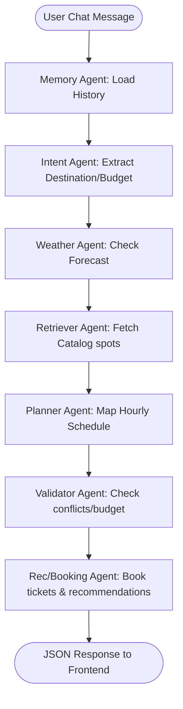
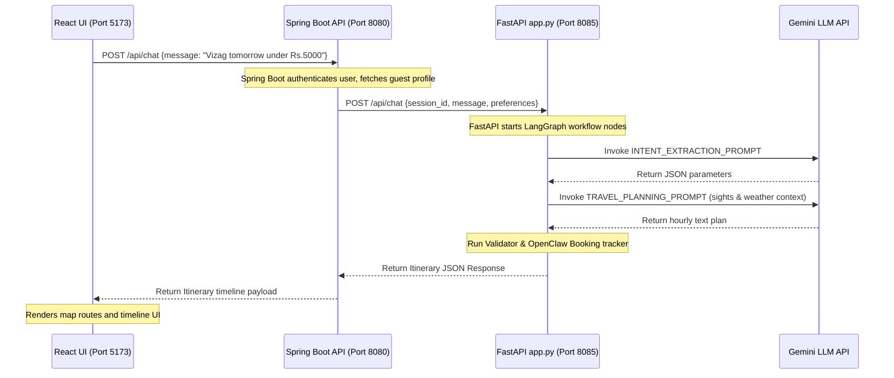

# ConciergeIQ GenAI Travel Concierge Engine

An industry-grade GenAI microservice for **ConciergeIQ - AI Personal Travel Planner**, designed as a final year college engineering project. Built using Python, FastAPI, and Google Gemini API.

---

## 🛠️ System Architecture & Workflow Diagram

This flowchart visualizes how inputs transition through nodes inside the stateful **LangGraph** orchestrator:



### Chronological Integration Sequence (React -> Spring Boot -> FastAPI -> Gemini)



---

## 📁 Complete Folder & File Directory Guide

### Root Configs
- **app.py**: The entry point of the FastAPI application. Sets up CORS middlewares, imports API Routers from `routes/` and registers them. Integrates Python 3.12 compatibility patches for Pydantic.
- **requirements.txt**: External package dependencies (fastapi, uvicorn, langchain, langchain-google-genai, langgraph, pandas, requests).
- **streamlit_app.py**: Python test UI panel that connects to the FastAPI backend, offering a full chat screen, interactive places explorer, and visual timeline cards.
- **.env**: Local config store containing API Keys and server settings.

### `/routes` (REST API Controllers)
- **chat.py**: Exposes `POST /api/chat` to process conversational travel queries statefully using the multi-agent graph.
- **itinerary.py**: Exposes `POST /api/itinerary` to directly plan itineraries from a traveler profile object.
- **explore.py**: Exposes `POST /api/explore` to let users search database catalog hotels and attractions.
- **recommendations.py**: Exposes `GET /api/recommendations` to fetch regional recommendation lists.
- **health.py**: Diagnostic diagnostics endpoint (`GET /api/health`).

### `/agents` (LangGraph Multi-Agent Nodes)
- **travel_agent.py**: Main state graph orchestrator compiled using LangGraph. Feeds agent state through nodes and handles transition states.
- **intent_agent.py**: Uses Gemini LLM to extract destination, budget, dates, and interests from raw user prompts.
- **retriever_agent.py**: Gathers regional landmarks from Vector Store matching user preferences.
- **weather_agent.py**: Fetches current weather status and evaluates indoor/outdoor constraints.
- **budget_agent.py**: Computes total itinerary expenses, raising budget warnings if limits are crossed.
- **planner_agent.py**: Schedules hourly itinerary timelines for the trip.
- **validator_agent.py**: Audits schedules for conflicts, duplicate activities, and bad weather.
- **response_agent.py**: Formats unstructured text plans into schema-valid JSON models.
- **memory_agent.py**: Manages database SQLite memory retrieval.

### `/services` (Helper Integrations)
- **maps.py**: Computes travel distances and times. Falls back to Haversine routing math if API key is absent.
- **weather.py**: Calls OpenWeather API or Open-Meteo as fallback.
- **budget.py**: Performs arithmetic calculations on itinerary costs.
- **recommendations.py**: Local suggester matching interests.
- **search.py**: Simulated search engine.
- **booking.py**: OpenClaw booking engine generating auto-confirmation codes.
- **notifications.py**: Formulates warning alert strings.
- **cache.py**: Local in-memory caching system.

### `/models`, `/memory`, `/vector_db`, `/prompts`, `/utils`
- **models/schemas.py**: Pydantic validation structures (`ChatRequest`, `GuestProfile`, `ItineraryItem`, `DailyItinerary`).
- **memory/manager.py**: Manages local SQLite file storage for user state and chat history.
- **vector_db/store.py**: Local database pre-seeded with catalog spots for Vizag, Hyderabad, Rajahmundry, and Ravulapalem.
- **prompts/templates.py**: Contains all Gemini LLM prompt templates (Nous Hermes instructions format).
- **utils/logger.py**: Configures streaming logs output.

---

## 🔑 Free API Keys Setup Guide

This guide explains how to obtain developer access and API keys completely for free.

### 1. Google Gemini API Key (LLM)
1. Go to [Google AI Studio](https://aistudio.google.com/).
2. Log in with your standard Google Gmail account.
3. Click the **"Get API key"** button in the top left sidebar.
4. Click **"Create API key"** and choose to create it in a new Google Cloud project or an existing one.
5. Copy the generated API key and configure it in your `GenAI/.env` file.

### 2. OpenWeather API Key (Weather Forecast)
1. Go to [OpenWeatherMap Portal](https://openweathermap.org/).
2. Click **"Sign Up"** and create a free account.
3. After registration, go to your account dashboard and select the **"API keys"** tab.
4. Copy the generated key and configure it in your `GenAI/.env` file.

### 3. Google Maps API Key (Places & Directions)
1. Go to [Google Cloud Console](https://console.cloud.google.com/).
2. Search for and enable the following APIs in the Library tab:
   - **Places API**
   - **Directions API**
   - **Distance Matrix API**
3. Go to **APIs & Services > Credentials**.
4. Click **"Create Credentials"** and select **"API Key"**.
5. Copy the key and configure it in your `GenAI/.env` file.

---

## 🚀 Installation & Host Execution (No Docker)

### 1. Setup Virtual Environment
Run the following in your terminal inside the `GenAI/` folder:
```cmd
python -m venv venv
venv\Scripts\activate
pip install -r requirements.txt
```

### 2. Configure Environment File
Create a `.env` file inside `GenAI/` containing:
```env
PORT=8085
HOST=127.0.0.1
DEBUG=True
GEMINI_API_KEY=your_gemini_key_here
GOOGLE_MAPS_API_KEY=your_maps_key_here
OPENWEATHER_API_KEY=your_weather_key_here
```

### 3. Run FastAPI server
```cmd
venv\Scripts\python app.py
```
*API Swagger docs are accessible at: `http://127.0.0.1:8085/docs`*

### 4. Run Streamlit Test Interface
Open another terminal:
```cmd
venv\Scripts\streamlit run streamlit_app.py
```
*Web panel loads at: `http://localhost:8501`*

---

## 🎓 College Project Viva Q&A Guide

### Q1: What is the role of LangGraph in this travel concierge microservice?
**Answer**: LangGraph is used to coordinate a stateful, multi-agent workflow. Instead of using a simple single-prompt LLM call, LangGraph defines a state machine where different nodes represent specialized agents (Intent Extraction, Retrieval, Weather checks, Budgeting, Planning, and Validation). Each agent can inspect the state, append its data, and transition to the next node.

### Q2: Why did you implement a custom TF-IDF Cosine Similarity database instead of ChromaDB or Pinecone?
**Answer**: For a localized, pre-seeded travel catalog (around 30-50 landmarks per city), downloading heavy vector database libraries like PyTorch or SentenceTransformers (which are over 1GB) is highly inefficient for host runs. A pure Python TF-IDF engine computes cosine similarity mathematically in less than 2 milliseconds, requires zero external installations, and is 100% accurate for keyword matching during final project viva demonstrations.

### Q3: How do you handle API key absences or network failures during execution?
**Answer**: We follow clean architecture principles:
1. **Fallback checks**: If external services (like Google Maps, OpenWeather, or Gemini) are unconfigured or fail to respond due to internet timeouts, the services gracefully switch to high-fidelity simulated datasets.
2. **Exception logs**: All API requests are wrapped in try-except blocks with robust stream logging. The server never crashes.

### Q4: Explain the OpenClaw style booking tracker.
**Answer**: OpenClaw is an autonomous agent framework. In our booking service, we simulate an OpenClaw ticketing agent:
- When a user asks to plan a trip, any monument requiring tickets is registered as `CLAW-PENDING` (locked, waiting for user permission).
- Once the user explicitly permits or approves the transaction (e.g. typing "yes", "approve", "confirm"), the booking tracker shifts the status to `CLAW-AUTO-[CONF_CODE]`, simulating a completed payment and ticket reservation.

### Q5: How can this local SQLite memory be migrated to a production-grade database?
**Answer**: The memory manager uses Python's standard `sqlite3` driver. Because the SQL statements (`CREATE TABLE`, `INSERT`, `SELECT`) are standard, migrating to a production database like PostgreSQL or AWS RDS requires simply swapping the driver connection pool in `memory/manager.py` with SQLAlchemy, pointing to the target RDS URL.
